# Where Should You have Lived 30 Years Ago?
This project visualizes how average weekly wages and rental costs have changed across all 50 US states and DC, using data pulled directly from two federal sources: the Bureau of Labor Statistics Quarterly Census of Employment and Wages (QCEW) and the Department of Housing and Urban Development Fair Market Rents (FMR). The goal is to answer a straightforward but revealing question: Has your paycheck kept pace with what it costs to put a roof over your head, and does the answer change depending on where you lived according to my baseline years?

The two initial scripts fetch raw data raw data for both wages and rent, computes growth rates relative to either baseline year, measures the affordability gap (how much faster rent has grown than wages), and renders that gap as choropleth maps, state-level heatmaps, and scatter plots spanning every 5 years from the baseline through 2024. The project ships two parallel sets of scripts: one using 1990 as the baseline and one using 2000 as the baseline. The original analysis starts from 1990, the earliest year available in the QCEW dataset. When you run those numbers, wage growth looks relatively healthy across most of the country through the 2000s and 2010s. What that framing quietly obscures is that the 1990s were an unusually strong decade for wage growth, a rising tide that inflated the starting point and made subsequent decades look more modest by comparison incluincluding the COVID-19 pandemic years which most would agree was not a particularly momentous years for affordability or wage growth.

Resetting the baseline to 2000 strips that tailwind away. With the 1990s boom removed from the picture, the 2000–2024 story looks considerably weaker: wage growth is slower, the affordability gap between rent and wages opens wider and earlier, and the state-by-state disparities become sharper and harder to dismiss. The same data, reframed, tells a meaningfully different story. This is not just a matter of using less data but a real and visible change of pace that the 1990s just drag the data toward a more misleading and seemingly happier image. Both baselines are kept intentionally. Seeing them side by side makes the distortion visible — it turns the methodological choice itself into part of the finding. The 1990 charts and the 2000 charts are not redundant; the gap between them is the point.
## Required data
### 1. BLS QCEW flat files
- Source: https://www.bls.gov/cew/downloadable-data-files.htm → Annual, Single File CSVs
- Years Needed: 1990–2024
- Place Files In: `QCEW Data Files/YYYY_annual_singlefile.zip`
- Each zip must contain `YYYY.annual.singlefile.csv`
### 2. HUD Fair Market Rent data
- Source: https://www.huduser.gov/portal/datasets/fmr.html → historical FMR data
- File Needed: `FMR_2Bed_1983_2026.xlsx` (2-bedroom FMRs, all counties)
- Place Files in: `HUD Rent Data/FMR_2Bed_1983_2026.xlsx`
### 3. US Census Shapefile
- Source: https://www.census.gov/geographies/mapping-files/time-series/geo/cartographic-boundary.html
- File Needed: `cb_2025_us_state_500k.zip` (state-level, 500k resolution)
- Place Files In: `shapefiles/cb_2024_us_state_500k.zip`
---
## Expected Directory Structure
```
project/
├── QCEW Data Files/
│   ├── 1990_annual_singlefile.zip
│   ├── 1991_annual_singlefile.zip
│   └── ... (through 2024)
├── HUD Rent Data/
│   └── FMR_2Bed_1983_2026.xlsx
├── shapefiles/
│   └── cb_2024_us_state_500k.zip
├── data/        # auto-created by fetch scripts
├── maps/        # auto-created by map scripts
├── maps_2000/   # auto-created by map scripts (2000 baseline)
├── charts/      # auto-created by compare scripts
├── charts_2000/ # auto-created by compare scripts (2000 baseline)
└── *.py
```
---
## Execution Order
### Step 1: Fetch Wages 
```
python fetch_wages.py
```

Reads all QCEW zips, filters to state-level private-sector all-industry rows (`own_code=5`, `industry_code=10`), and writes:
- `data/wages_wide.csv` — raw average weekly wages
- `data/wages_growth.csv` — % change from 1990
- `data/wages_growth_2000.csv` — % change from 2000

**IMPORTANT**: This section will take the longest, especially the formatting for wage growth. Expect up to 5-10 minutes for it to load if doing all years.
However this can also function without all of them as long as there are two different files of two seperate years the following scripts will work but naturally, there is less of a comparison that is can run (ex. Downloading just 1990 and 2024, or 2000 and 2010)
**This will impact all the following maps, charts, and scatter plots but the key years are the 5 year increments from 1990 onward**
### Step 2: Fetch Rent
```
python fetch_rent.py
```
Reads the HUD xlsx, computes median 2BR FMR per state per year, and writes:
- `data/rent_wide.csv`
- `data/rent_growth.csv` — % change from 1990
- `data/rent_growth_2000.csv` — % change from 2000

### Step 3: Compare Wages to Rent (generates merged data + charts)
```
python compare_wages_to_rent.py       # 1990 baseline
python compare_wages_to_rent_2000.py  # 2000 baseline
```
Merges wage and rent growth and computes the affordability gap(`rent_growth - wage_growth`) and writes:
- `data/wages_vs_rent.csv`
- `data/wages_vs_rent_2000.csv`
- heatmap and trend line charts to `charts/` and `charts_2000/`

### Step 4: Wage Growth Charts Across States
```
python compare_wages_across_states.py       # 1990 baseline
python compare_wages_across_states_2000.py  # 2000 baseline
```
Produces a scatter plot and rankings heatmap to `charts/` and `charts_2000/`.

### Step 5: Choropleth Maps
```bash
python map_wages.py               # Wage Growth Maps, 1990 baseline
python map_wages_2000.py         # Wage Growth Maps, 2000 baseline
python map_affordability.py       # Affordability Gap Maps, 1990 baseline
python map_affordability_2000.py # Affordability Gap Maps, 2000 baseline
```
Generates one PNG per target year as specified into `maps/` or `maps_2000/`. 

---
## Results 

## 1990 Baseline Results
### Affordability Mapping 
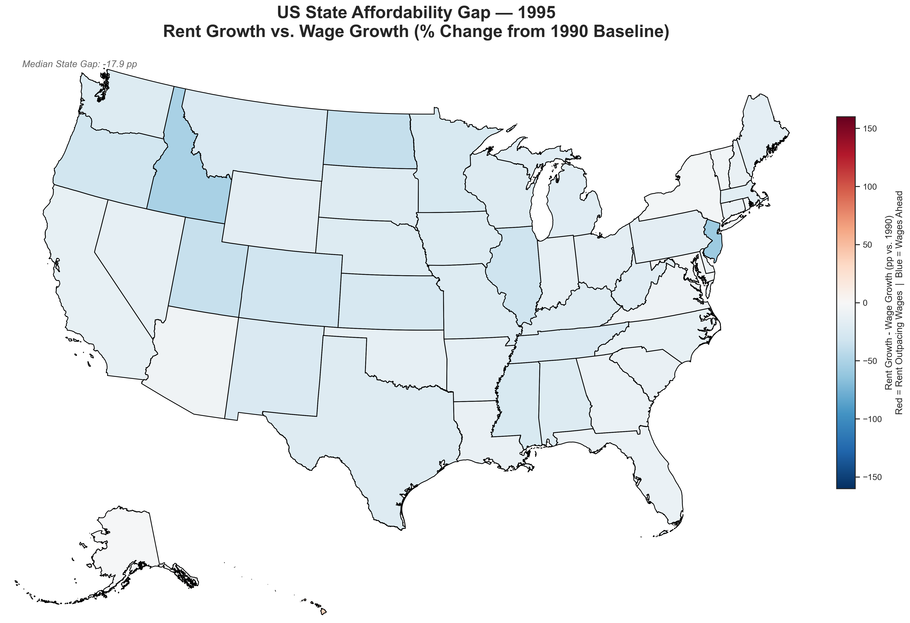
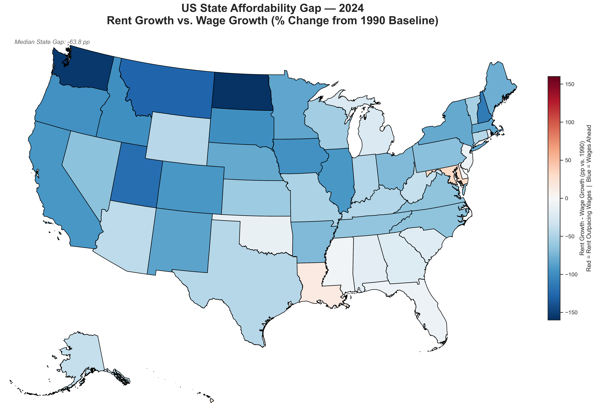
- By 1995 the affordability picture seen across the U.S. was relatively quite mild with nearly all states shown in light blue indicating that wages were modestly outpacing rent growth compared to the 1990 baseline: with the national median gap only being -17.9%. By 2024, the situation had shifted dramatically across virtually the entire country. With the median gap deepening to a slight recovery to around -55 by 2024 (national average), compared to a median gap of -63.8% from the choropleth maps. Only Louisiana appears to have been in the faint red tone in 2024 meaning that it was one of the very few places where rent growth did outrun wages.

# 1990 Baseline Results
### Wage Growth
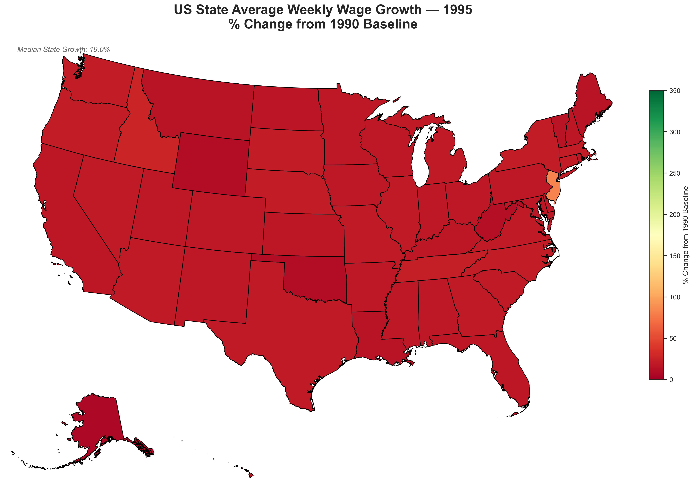
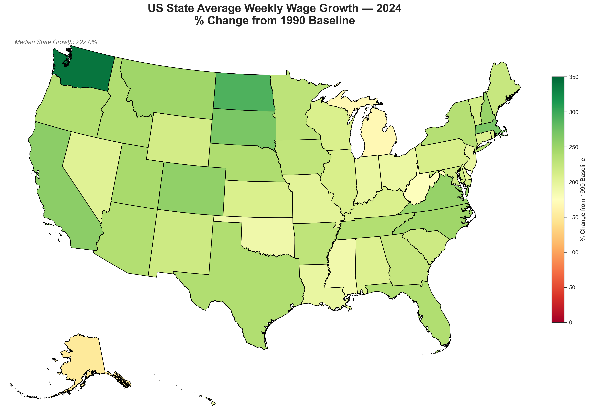
- In 1995, wage growth across all US states was uniformly low relative to the 1990 baseline with nearly the entire map appearing in dark red, reflecting a median growth of only 19%. Wages had barely moved in the first half of the decade but by 2024, the picture had transformed completely, with every state showing substantial wage gains (all green), and the national median reaching 222% growth from 1990, led by Washington state at over 340%.

# 1990 Baseline Results
### Charts
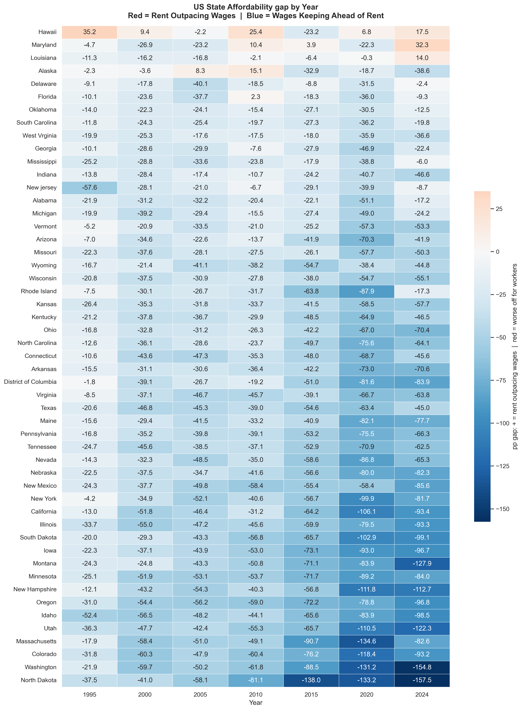
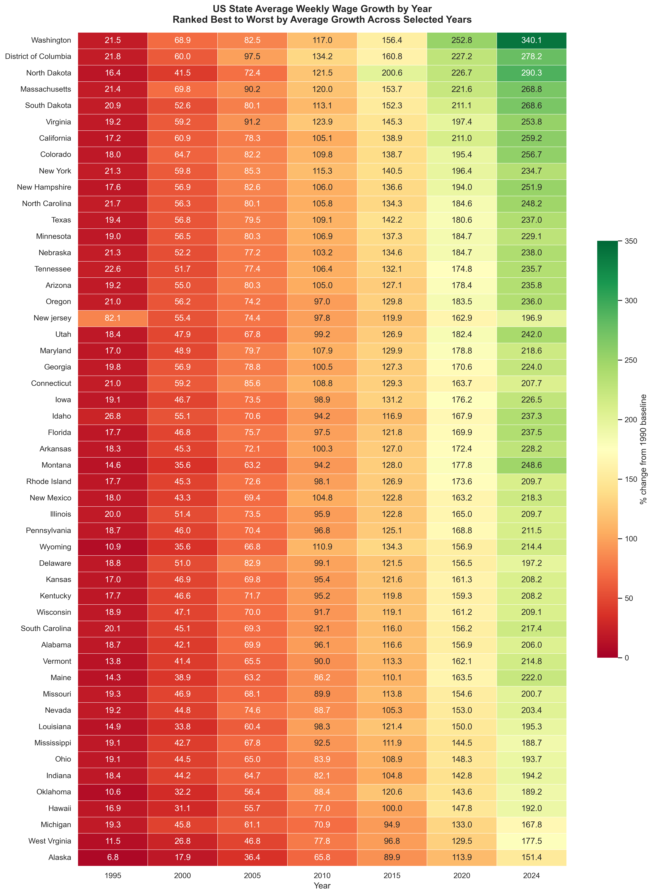
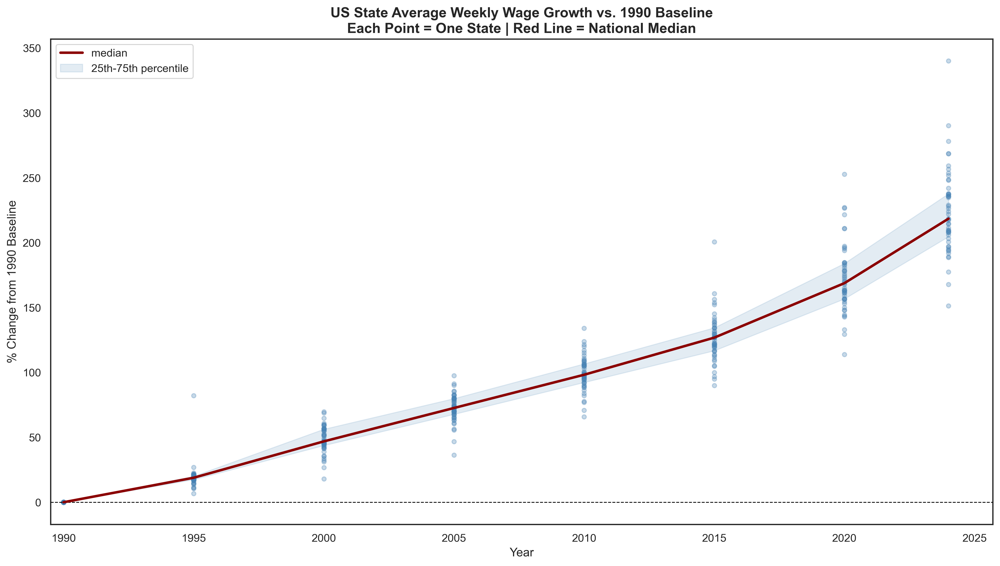
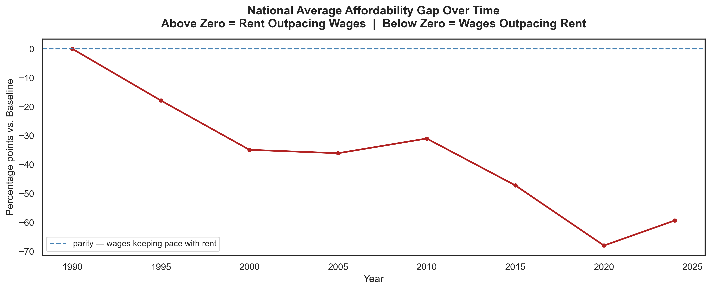
- The affordability gap heatmap shows each state's rent-versus-wage gap across selected years from 1995 to 2024, sorted from worst to best by average gap over the period. In early years, the heatmap is dominated by blue, reflecting the 1990s wage boom that kept wages comfortably ahead of rent across nearly every state. The blue gradually fades through the 2000s and 2010s as the gap narrows, and by 2020 and 2024 large swaths of the heatmap have turned red, with states in the South and Mid-Atlantic were hit the hardest registering the deepest losses reflecting places where rent has surged well past wage growth over the full 35-year window.
- The state rankings heatmap ranks all states from best to worst in average weekly wage growth, with Washington, Washington DC, North Dakota, and Massachusetts consistently leading the pack across all years. States like Alaska, West Virginia, and Michigan consistently trail, showing the weakest cumulative wage growth from the 1990 baseline through 2024.
- The wage growth scatter plot shows every US state's wage growth trajectory from 1990 to 2024, with the national median rising from 0% at the baseline year to roughly 220% while the spread between states widens significantly after 2018. The widening band of dots in recent years highlights growing inequality in wage growth across states, with a handful of outliers pulling well above 300%.
- The national affordability gap line shows the national average affordability gap declining to roughly -75 percentage points by 2022, reflecting how far wages had pulled ahead of rent under this baseline before partially giving back that lead, with a slight recovery to around -55 by 2024. The trajectory makes clear that the post-2019 period allegedly saw the sharpest narrowing of wage advantage in the entire 35-year window.

**IMPORTANT** Clealry, these results do not show the changes that a predominant segment of the population has felt over the past 20 years especially considering the past few years. Which are more prevalently showcased in the following analysis with a different baseline year shows widely different results.

---

# 2000 Baseline Results
### Affordability Calculation
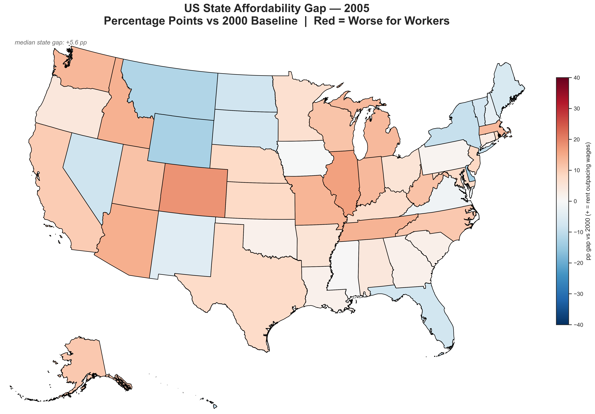
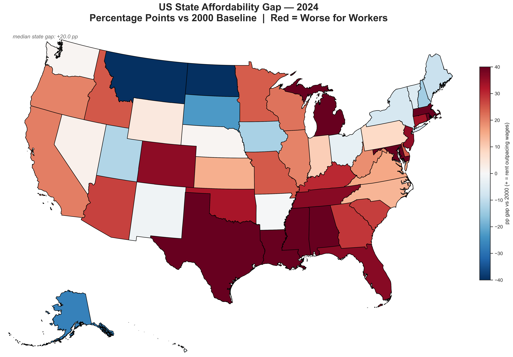
- By 2005, just five years from the baseline, the affordability gap had already begun emerging unevenly across the country, with a national median of +5.6% indicating rent was modestly outpacing wages in most states. The map shows a patchwork of light orange across much of the South, Southwest, and Pacific Coast, with Colorado standing out as the single deepest red state, while a cluster of Northern Plains and Mountain states including Montana, Wyoming, North Dakota, and New Mexico along with Florida and parts of the Northeast, appeared in blue, meaning wages were still holding ahead of rent there. By 2024, that early patchwork had consolidated into a far more severe and geographically concentrated crisis, with the national median gap widening to +20.0% and the entire South such as Texas, Louisiana, Mississippi, Alabama, Tennessee, and Kentucky turning deep crimson, indicating rent has dramatically outrun wages since 2000.

# 2000 Baseline Results
### Wage Growth
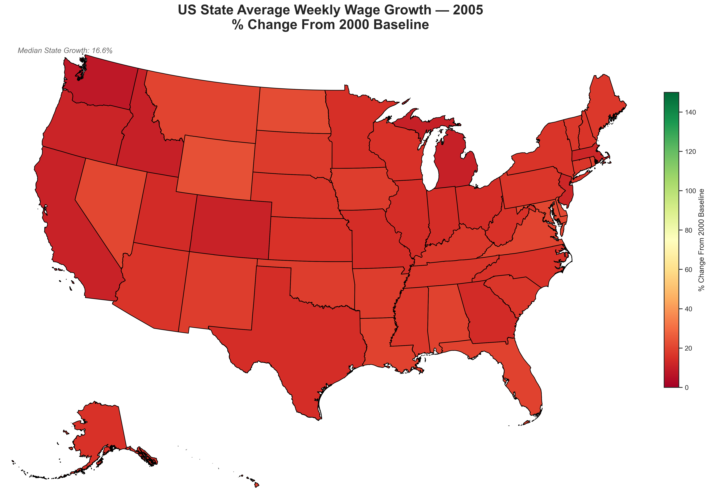
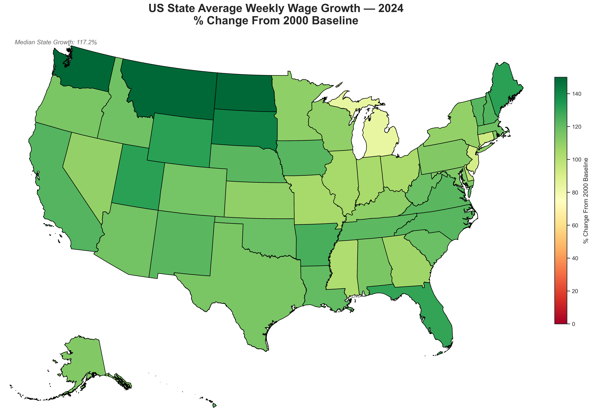
- In 2005, wage growth from the 2000 baseline was still modest and uniformly low across the country, with a national median of just 16.6% and the entire map rendered in shades of red-orange — Washington state was the lone slightly darker outlier, while Nevada, Colorado, and parts of the Mountain West showed slightly lighter tones reflecting marginally stronger early gains. By 2024, the full transformation is complete, with every state having crossed firmly into green at a national median of 117.2%, led by Washington, Montana, North Dakota, and South Dakota in the deepest greens above 140%, while Michigan, New Jersey, Connecticut, and several Mid-Atlantic states remain in pale yellow-green as the laggards of the 24-year wage growth story.

# 2000 Baseline Results
### Charts
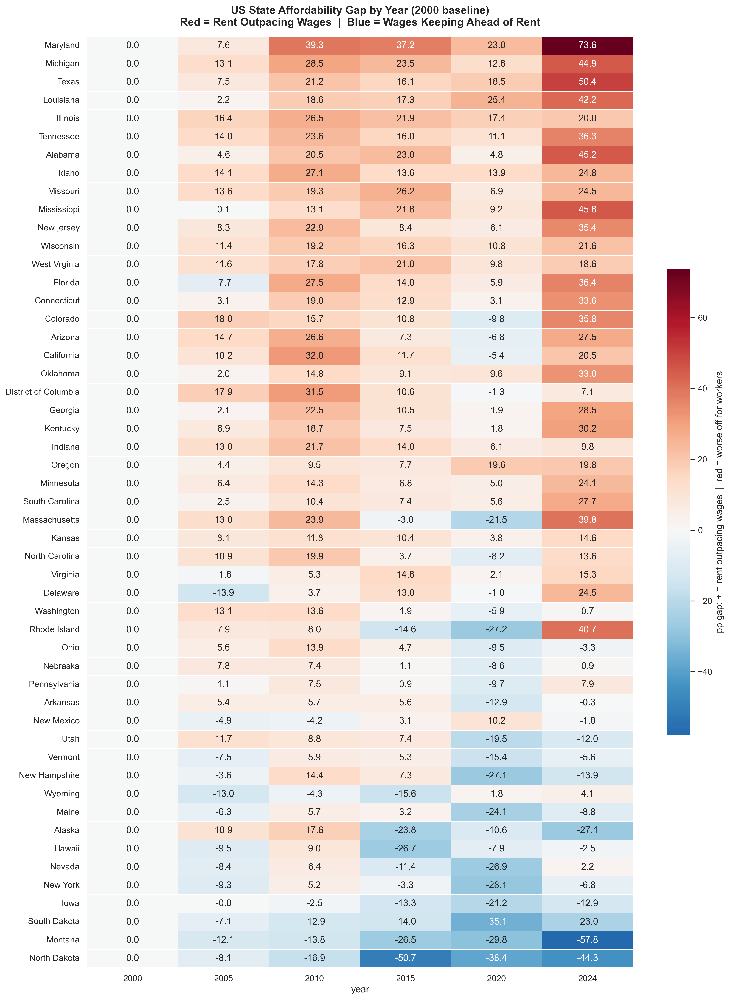
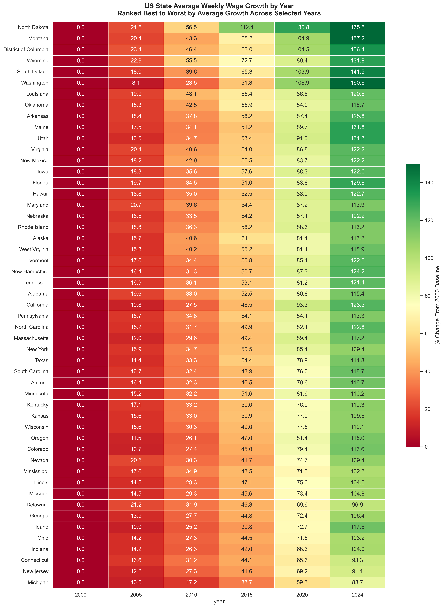
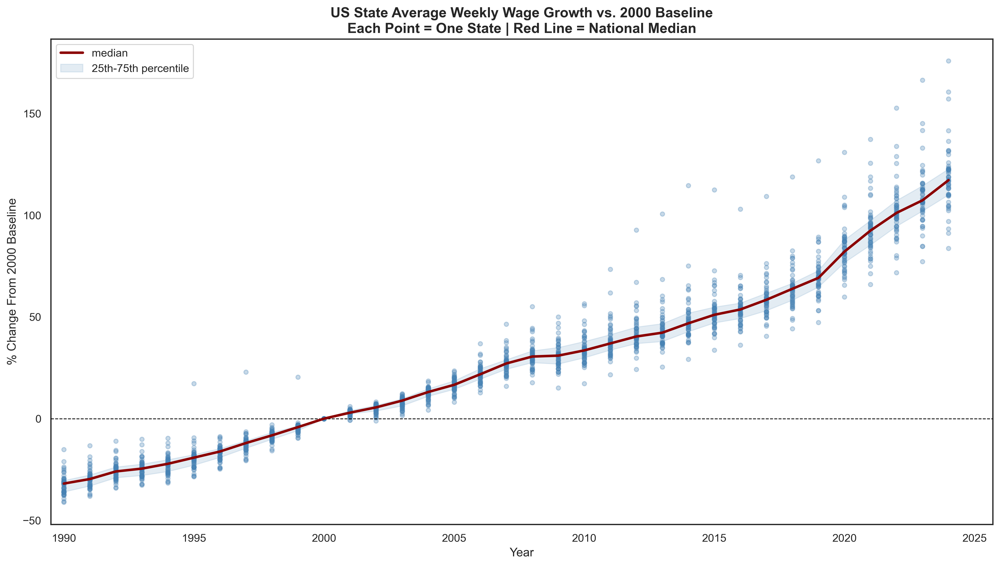
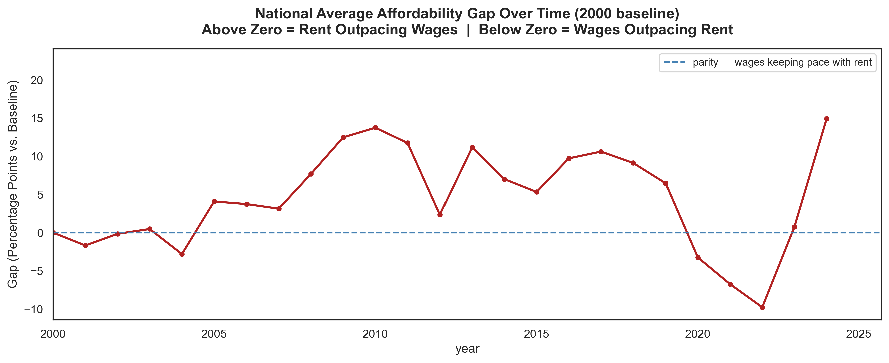
- The affordability gap heatmap tracks each state's affordability gap relative to 2000, with red indicating rent outpacing wages and blue the reverse and shows that most states moved deeply into the red during the 2005–2010 period before some partial recovery. By 2024, Maryland (+73.6), Michigan (+44.9), Mississippi (+45.8), and Texas (+50.4) stand out as the states where rent has severely outrun wages since 2000, while Montana (-57.8) and North Dakota (-44.3) remain the strongest outliers where wages have kept well ahead of rent.
- The state rankings heatmap ranked from strongest to weakest wage growth since 2000, North Dakota leads decisively at +175.8% by 2024, followed closely by Montana, DC, Wyoming, and South Dakota; all resource-rich or government-driven economies. Michigan sits at the bottom of the rankings with only 83.7% cumulative growth since 2000, joined by Connecticut, New Jersey, Indiana, and Ohio as the states whose workers have seen the weakest wage gains over the 24-year period.
- The wage growth scatter plot shows every US state's wage growth trajectory from 2000 to 2024, with each dot representing one state per year and the national median rising from 0% to roughly 117% by 2024. The spread between states is already visible by 2010 and widens further through 2020 and 2024, with North Dakota, Washington, Montana, and South Dakota pulling well above the pack while Michigan, Connecticut, and New Jersey consistently sit at the lower end of the band.
- Unlike the 1990-baseline version of the national affordability gap trend line which showed a relentless downward spiral, this 2000-baseline chart reveals a more volatile story. The national gap actually turned positive (rent outpacing wages) for most of the 2005–2020 period, peaking around 2009–2010 near +14 percentage points. The gap briefly dipped negatively around 2022 before sharply rebounding to +15 by 2024, suggesting a renewed and accelerating affordability crunch driven largely by the post-pandemic rent surge.

# Conclusion 
The data tells a clear and striking story. Despite starting from only a decade prior, there is a stark difference that captures what many have already been feeling, which is that the cost of renting is ballooning faster than states can hope to grow their economies and in turn raise wages. Starting from 1990, wages and rent were broadly in sync, but the 1990 baseline quietly obscures more than it reveals. Because the 1990s were an unusually strong decade for wage growth, the affordability gap under that framing fell deep into negative territory, reaching roughly -63 percentage points by 2024, which under the project's own definition means wages nationally outpaced rent from that starting point. That looks like a success story, but it is largely a product of where the clock started. Resetting the baseline to 2000 strips that tailwind away and the picture changes sharply. The gap flips positive, meaning rent is now outpacing wages, and by 2024 the national median had grown to +20 percentage points in rent's favor. States across the South were hit the hardest. States in the South and Mid-Atlantic were hit the hardest now carry some of the worst rent-to-wage gaps in the country, with several states sitting between +44 and +73 percentage points. Notable exceptions exist in states like Washington, North Dakota, and Montana, where wage growth was strong enough to offset rent increases, an outcome largely attributable to concentrated industries like tech and energy. Wages across the board have grown substantially in nominal terms, but the results vary and some states are definitively hit harder than others.

What this analysis does not capture is public-sector workers, which could further affect the severity of the results, since this overview focuses primarily on the private sector and two-bedroom rental units. Additional work incorporating other unit types such as single-bedroom and three and four-bedroom apartments would add meaningful depth. So too would data on homeownership and the full labor market beyond just the private sector. Together these additions could provide greater context to the severity of the conditions people now find themselves in, whether years into the workforce or, for people like me, just entering it. Different base years can easily be switched in the mapping scripts that can grant even more precise account of more recent years as well where if curious anyone, can do and see even more staunchly contrasting results.

For now, what this all points to is a structural misalignment between where wages are growing and where rent pressures are most acute. For workers in the South and coastal metros especially, the gap between what they earn and what they owe in rent has never been wider.

